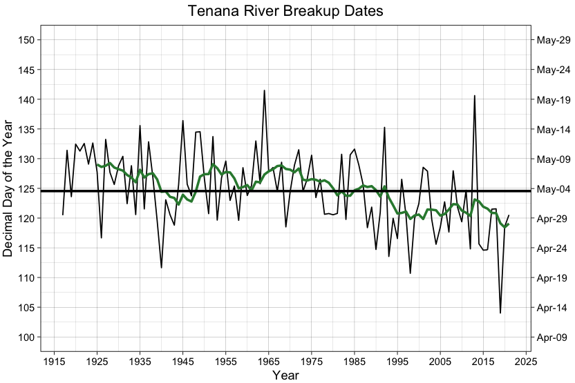
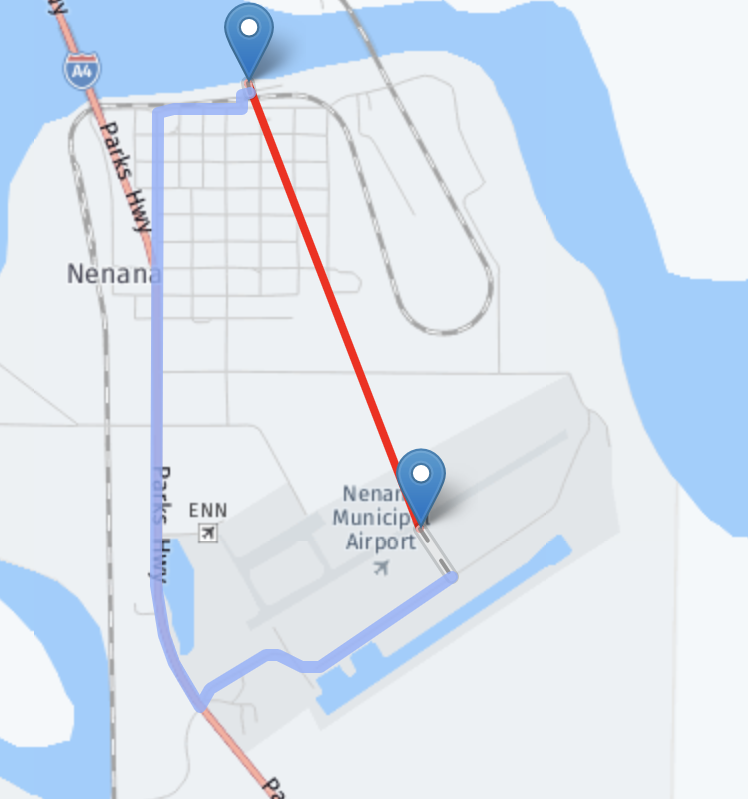

## Why now?
Gambling in Alaska is strictly controlled outside of bingo and pulltabs, so the Nenana Ice Classic is one of the few sanctioned gambling outlets you can legally participate in for the state. I lived in Anchorage for 8 years and am not a big gambler. So, I didn't participate while I lived in state, but prediction is always a fun and interesting challenge so I figured I'd finally give it a try.

Interestingly enough, I'm not the only person to attempt to take a scientific approach to predicting the ice breakup[^1]. Tommy Lee Waters won three different years by drilling holes to measure ice thickness in the area, studying historical data and spending $5,000 on guesses. (That's 2,000 guesses, by the way.)
## Data Sources
### National Snow and Ice Data Center
The [National Snow and Ice Data Center (NSIDC)](https://nsidc.org/) collects and shares snow and ice data from digital and analog sources. The Tenana River ice annual break up dates for Nenana, AK[^2] are stored by NSIDC under [data set ID NSIDC-0064](https://nsidc.org/data/nsidc-0064). This dataset contains ice breakup date of each year from 1917-2021. The date is broken down to `year`, `month`, `date`, `time` and `decimal_day` of the year, which represents both the day of the year and time of the day in the same record. All breakup times are logged in Alaska Standard Time.

**Table 1. Example Data from the NSIDC Dataset**

| Year|Month | Day|Time     | Decimal Day|
|:---:|:----:|:--:|:-------:|:----------:|
| 2016|April |  23|15:39:00 |    114.6521|
| 2017|May   |   1|12:00:00 |    121.5000|
| 2018|May   |   1|13:18:00 |    121.5542|
| 2019|April |  14|00:21:00 |    104.0146|
| 2020|April |  27|12:56:00 |    118.5389|
| 2021|April |  30|12:50:00 |    120.5347|

I've plotted the Tenana River ice breakup dates for this period below, with the dates in day of the year on the left and calendar date on the right axes. The green line represents the 9-year moving average and the bold horizontal line is the mean break up date for the period, which is the 124th day of the year or May 4th.

 
<b>Figure 1. Time series of the Tanana River ice breakup dates for the period 1917-2021.</b>

 
There is some drift in the data, as you can see over the course of the period that the breakup date is getting earlier and earlier in the year. This is likely due to global warming.

### Weather Data
I sourced my weather data from [National Centers for Environmental Information from NOAA](https://www.ncei.noaa.gov/). Daily weather data from before 1977 for Nenana, AK is quite sparse and the nearest weather station is the Nenana Municipal Airport. The weather station is reasonably close to the tripod (approximately 1.25 miles away). This is seen below, where the weather station is located at the airport and the second point is the location of the Nenana Ice Classic tripod.

 
<b>Figure 2. Location of the Nenana Municipal Airport in relation to the Ice Classic tripod.</b>

Key parameters I intend to use for modelling are:  
+ Daily Temperature (Low, Mean and High, in °F)
+ Heating Days (24h-Mean Temperature < 65°F)
+ Ice Days (24h-Max Temperature < 32°F)
+ [Heating Degree Days](https://en.wikipedia.org/wiki/Degree_day#United_States) (Mean Temperature Difference < 65°F)
+ Modified Heating Degree Days (Mean Temperature Difference < 32°F)

The Tenana River typically freezes between October and November each year[^4] and the last day to submit guesses is April 5th. I'll use weather data from October 1st to March 31st (6 months) for the prediction intervals.

[^1]: [CBC Article: *Alaska $350K ice jackpot goes to expert forecaster*](https://www.cbc.ca/news/world/alaska-350k-ice-jackpot-goes-to-expert-forecaster-1.1249394)
[^2]: Nenana Ice Classic. Edited by W. N. Meier and C. F. Dewes. 2020. Nenana Ice Classic: Tanana River Ice Annual Breakup Dates, Version 2. Boulder, Colorado USA. NASA National Snow and Ice Data Center Distributed Active Archive Center. doi: [https://doi.org/10.5067/CAQ58H42LQY2](https://doi.org/10.5067/CAQ58H42LQY2). 2022-02-16.
[^3]: Global Surface Summary of the Day - GSOD. User Engagement and Services Branch. 2021. User Engagement and Services Branch (National Climatic Data Center, NESDIS, NOAA, U.S. Department of Commerce). gov.noaa.ncdc:[C00516](https://www.ncei.noaa.gov/metadata/geoportal/rest/metadata/item/gov.noaa.ncdc%3AC00516/html#). 2022-03-10.
[^4]: [Nenana Ice Classic Wikipedia](https://en.wikipedia.org/wiki/Nenana_Ice_Classic)

<!--
## Climate and Weather Data
-->