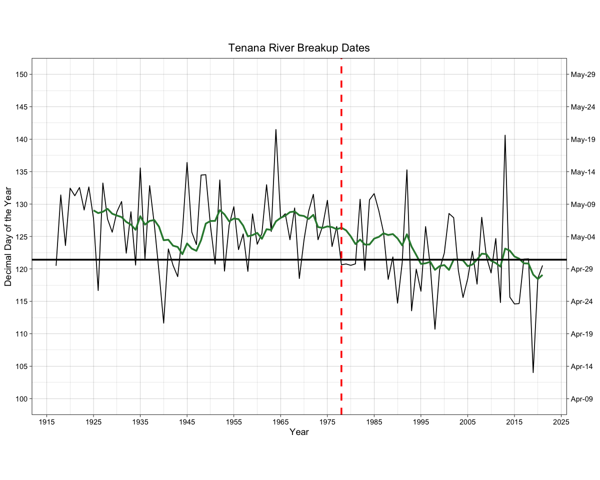
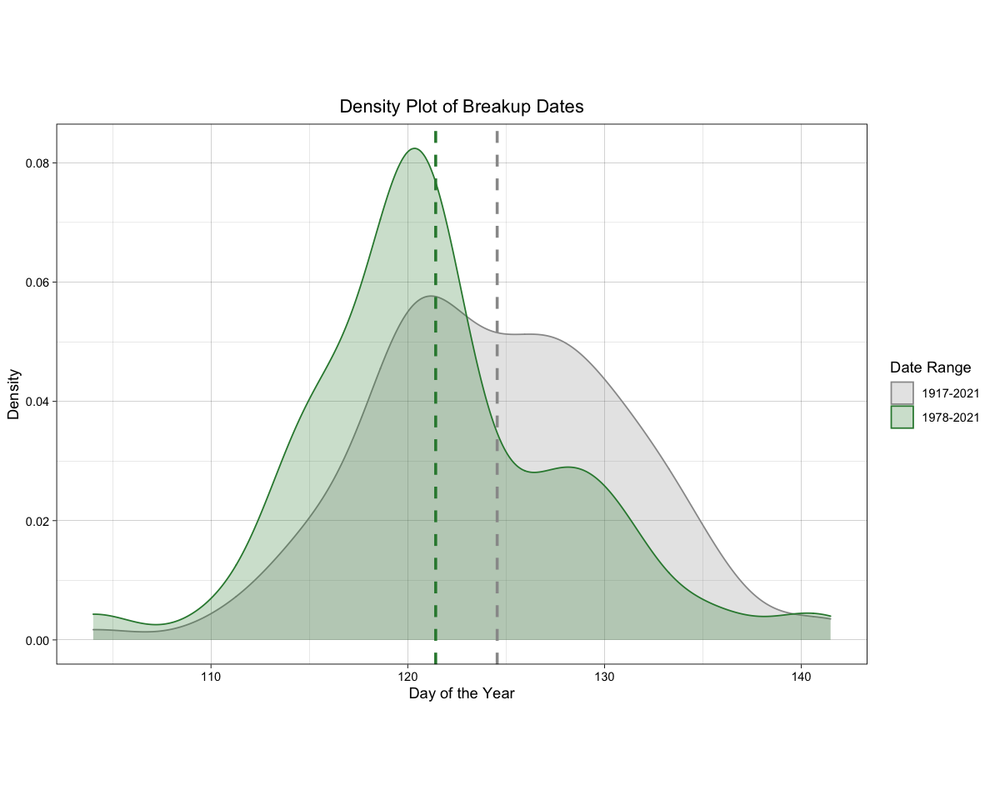
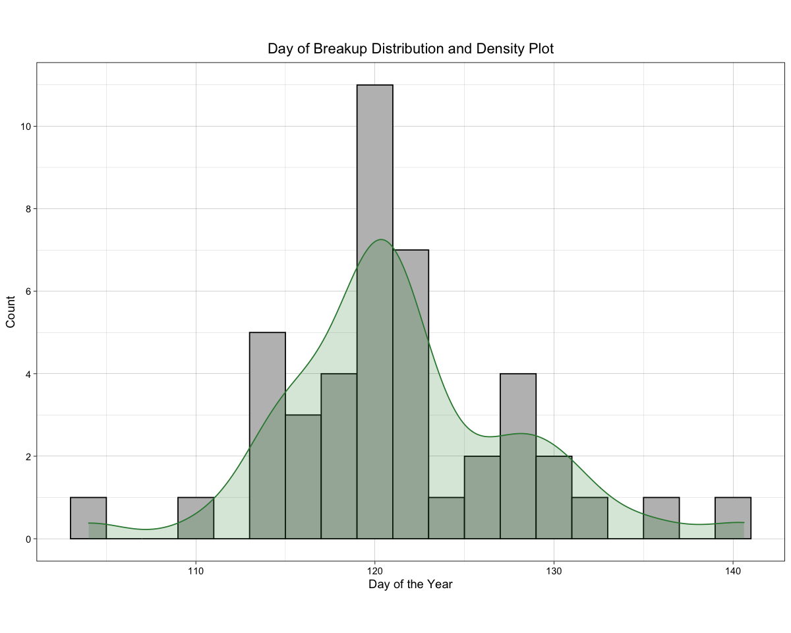
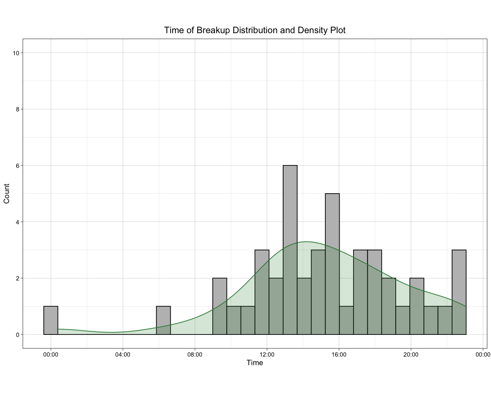

### National Snow and Ice Data Center

Since weather data for Nenana is sparse before 1977, I'll only be using weather data from then to the present. Below, I've replotted the Tenana River ice breakup dates. The year 1978 is marked with a vertical dashed red line, and the bold horizontal line is the mean break up date for 1978-2021 (which is the 121th day of the year, or May 1st).

 
<b>Figure 1. Time series of the Tanana River ice breakup dates for the period 1917-2021 with the mean breakup date for 1980-2021 indicated by the bold horizontal line.</b>

I've created a density plot of the breakup dates by time period below in Figure 2. You can see the mean breakup date for 1980-2021 is approximately three days earlier than the average for the entire period.

 
<b>Figure 2. Density plot of the Tanana River ice breakup dates by time period.</b>

Looking at the histograms of the breakup date and time of day proved interesting. I added a density plot layer to smooth out trying to read the plots. For the day of the year, there is a peak around 120 days with a second smaller peak around a week later. For the time of day, it appears breakup peaks noon-4 pm and tapers off the rest of the evening and not typically occuring midnight-8 am.

 
<b>Figure 3. Histogram and density plots of the Tanana River ice breakup by date and time of day.</b>

So, if you were to guess from historical data: the 121st day of the year (May 1st, or April 30th on leap years) sometime between noon and 4 pm would get you pretty close.

<!--
## Climate and Weather Data
-->